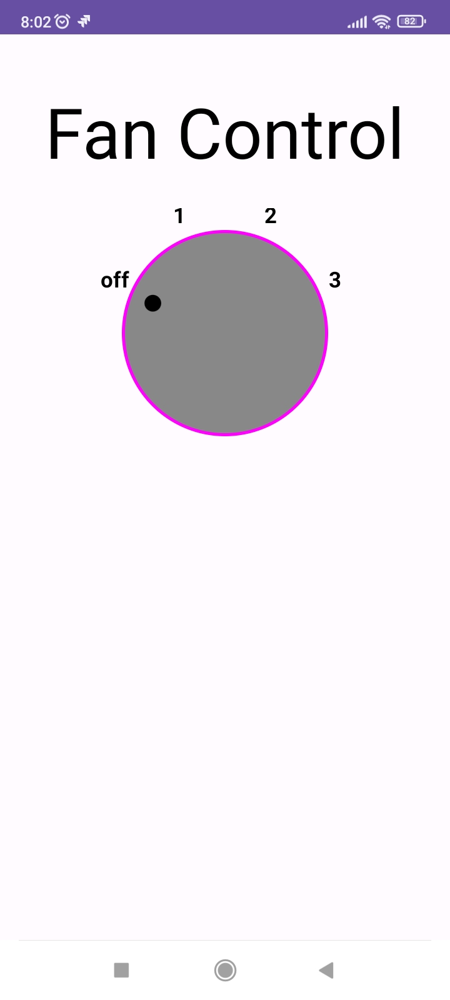
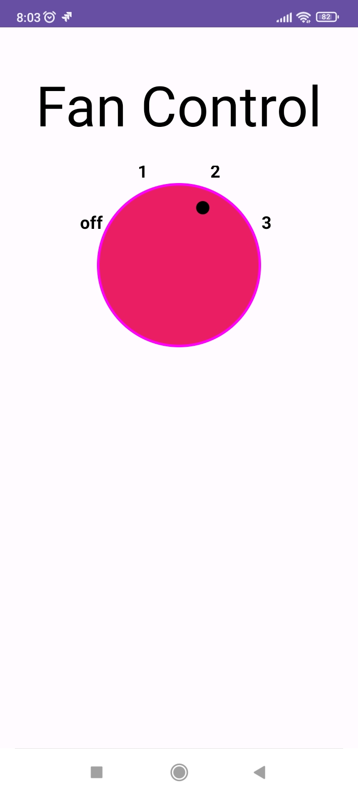

# CustomFanController
App to demo key concepts in Custom Views

1. @JvmOverloads
    When subclassing View, this annotation instructs the Kotlin compiler to generate overloads for this function that substitute default parameter values.

    To understand this, take an example of the class below:

    ```Kotlin
    class Mtu @JvmOverloads constructor(val jina: String,
          val umri: Int = 21,
          mji: String = "Turkana"
         ) { 
            fun info() { 
                println("Jina: $jina, Umri: $umri, Mji: $mji")
            }
        }
   ```
   
    For Java interoperability, the annotation will generate the extra overloads:
    
    ```Java
       public class Mtu(String jina, int umri, String mji) {
        // First generation - no defaults set
       }
   ```
      ```Java
       public class Mtu(String jina, int umri) {
        // Second generation - the default value for mji is used here.
       }
   ```
      ```Java
       public class Mtu(String jina) {
       // Second generation - the default values for mji & umri is used here.
       }
   ```
   
    Going forward, any of the generated overloads can be used to create a Mtu object based on the requirements.
    ```Java
         Mtu waKwanza = new Mtu("Upendo", 34, "Mtwapa"); 
         Mtu waPili = new Mtu("Suleiman", 13); 
         Mtu waTatu = new Mtu("Kijana"); 
   
        waKwanza.info(); // Output: "Jina: Upendo, Umri: 34, Mji: Mtwapa"
        waPili.info(); // Output: "Jina: Suleiman, Umri: 13, Mji: Turkana"
        waTatu.info(); // Output: "Jina: Upendo, Umri: 21, Mji: Turkana"
   ```
   The various overloads can be used based on the caller's requirements.

2. Overrides
   ### onSizeChanged
      Called when the correct size of the `canvas` has been calculated and is available for use. Remember that using the size of the canvas in other places such as `onCreate` will give you `0,0`.

   ### onDraw
      Called when the view should render its content, the canvas is also provided here.
      
      There are two options, `onDraw(canvas: Canvas?)` and `onDraw(canvas: Canvas)`, when extending `View`, it is safer to use the nullable option to gracefully handle cases where the function is invoked before the view is ready.  
      When extending `ViewCompat` there is guarantee that you will always have a place to draw and hence can use the non-nullable canvas.

   ### performClick
      This calls `onClickListener()` which allows users to handle click events.
   
3. Custom Attributes
      In addition to the attributes passed down from your extended parent, you can define you own attributes using `declare-stylable` property in res/values/attrs.xml file.
      
      This will be made available to your view in XML, keep in mind that you should use `app:` preface because the custom attributes belong to your app's namespace rather than the android.
      
      These attributes should be applied in the `init` block of the custom view because that is the earliest place to define such static values.

4. Other things to note
   - `invalidate()` is used to force a draw or redraw of the view.
   - Initializing variables and space allocation should be done outside `onDraw()`, let this function handle the hard work that is supposed to.
   
5. Sample Screenshots

   &nbsp;&nbsp;&nbsp;&nbsp;
   